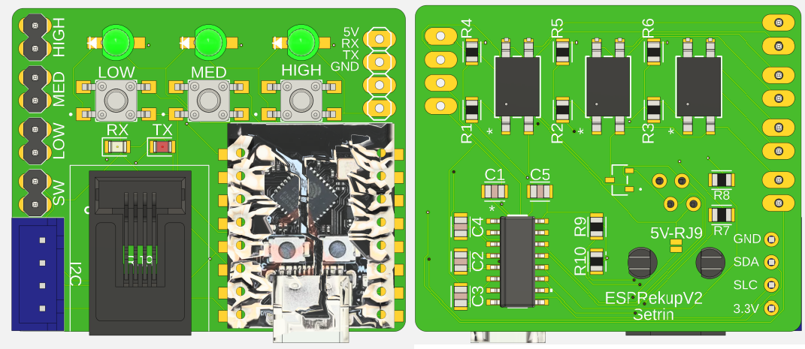
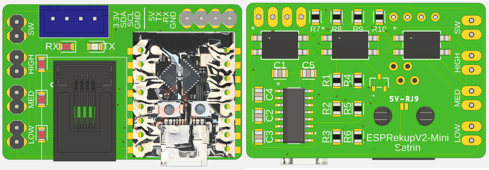
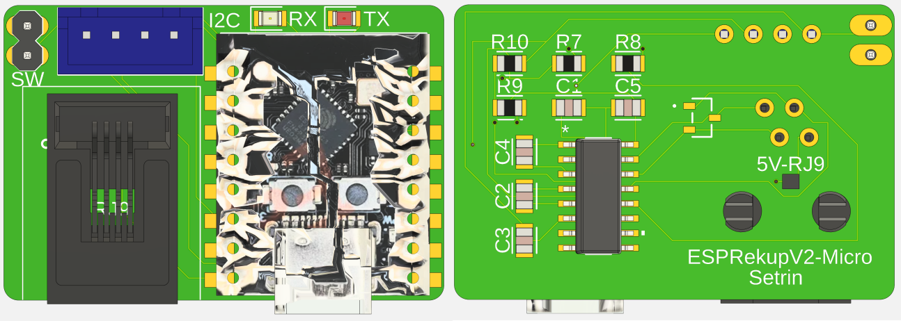

# ESPRekup V2

**ESPRekup V2** — compact ESP32-C3 based controller boards designed specifically for the **Vent-Axia Sentinel Kinetic B**.  
Provides optocoupler switch emulation, RS232 diagnostics, wall-switch inputs and optional I²C sensors.

---

## Variants

### Full
- 3 optocouplers (SW1/SW2/SW3), 3 front buttons, wall impulse inputs, RS232 header, I²C.
- Visible user interface.
- [Schematic](ESPRekupV2-32-Schematic.pdf)

  

### Mini
- Same I/O as Full but **no front buttons** — intended for internal mounting inside the MVHR case.

  

### Micro
- Minimal: RS232 + wall impulse inputs + I²C. Small footprint.

  

---

## Key points
- **Target device:** Vent-Axia Sentinel Kinetic B
- **Optocouplers** emulate the physical low/med/high switch closures expected by the Sentinel. This is the most compatible control method.  
- **RS232** is available for diagnostics and higher-level control if supported by your unit.

---

## Powering
- The board can be powered **either** from USB **or** from the MVHR via the RJ9 connector.  
- To select MVHR power, **bridge the power jumper on the back of the PCB** (check the silkscreen for the jumper label).  
- ⚠️ **Do NOT power from USB and RJ9 at the same time.** Removing one source before applying the other is mandatory to avoid damage.

---

## References

- @Alextrical PCB Design inspiration [ESP32-Sentinel-Kinetic-Wireless-Dongle](https://github.com/alextrical/ESP32-Sentinel-Kinetic-Wireless-Dongle)
- @Alextrical ESPHome Component [ESPHome-Vent-Axia-Sentinel-Kinetic](https://github.com/alextrical/ESPHome-Vent-Axia-Sentinel-Kinetic/)
- @aelias-eu Vent-Axia wired remote protocol reverse engineering [vent-axia-remote](https://github.com/aelias-eu/vent-axia-remote)

---
